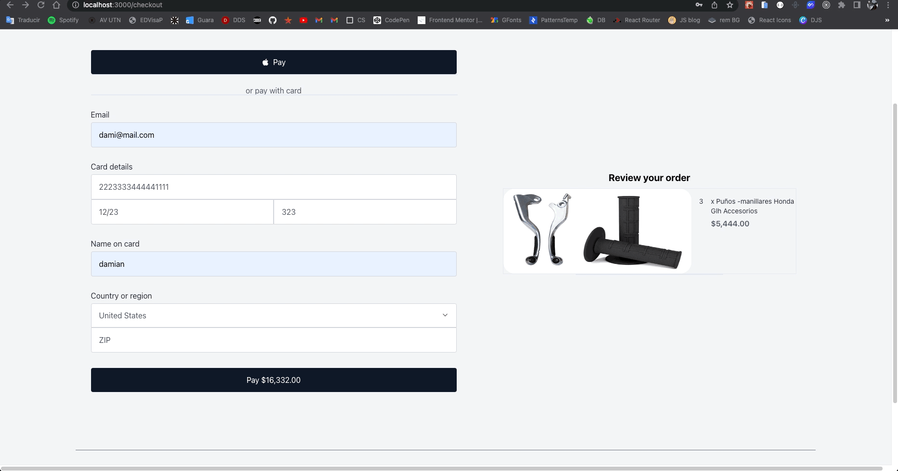

# Ecomm e-commerce

This is a React v18 proyect, creating an e-commerce with Tailwing css framework to style, Chakra UI library to get modals and animations.
In the project we consume an API to get data with differents endpoints from the frontend.

## Get started with this application 🚀

### Pre-requisites 📋

You have to install node js, talwinds css, chakra ui library.

The followings websites to get started:
- https://nodejs.org/es/download/package-manager/
- https://tailwindcss.com/
- https://chakra-ui.com/

## Deployment 📦

If you want to run this app, you can open a terminal, and write: git clone git@github.com:sanchezdamianj/ecomm.git

# Getting Started with Create React App

This project was bootstrapped with [Create React App](https://github.com/facebook/create-react-app).

## Available Scripts

In the project directory, you can run:

### `npm start`

Runs the app in the development mode.\
Open [http://localhost:3000](http://localhost:3000) to view it in your browser.

The page will reload when you make changes.\
You may also see any lint errors in the console.

Step 1 when the app is running, you must to create a user with an email, and password
Step 2 Logged with your credential

## Construido con 🛠️

* [React](https://es.reactjs.org/docs) - Frontend JS Library - 
* [Tailwind css](https://tailwindcss.com/docs) - Styles -
* [Firebase](https://firebase.google.com/) -

## Versionado 📌

Usamos [git](http://git.io/) para el versionado. Para todas las versiones disponibles, mira los [tags en este repositorio](https://github.com/sanchezdamianj/ecomm/tags).

## Autores ✒️
* **Damian Javier Sanchez** - *Frontend Proyect* - [sanchezdamianj](https://github.com/sanchezdamianj)
## Skills to create this project ✒️

## Licencia 📄

Este proyecto es propiedad de DJS

---
⌨️ con ❤️ por [sanchezdamianj](https://github.com/sachezdamianj/ecomm) 😊

